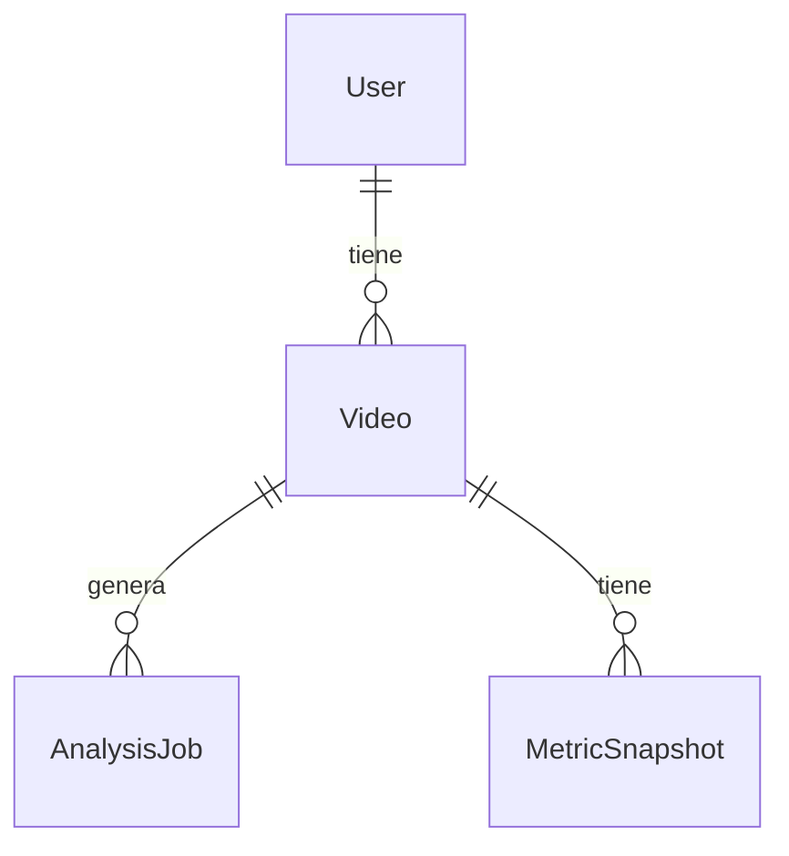

# Diseno de Base de Datos (PostgreSQL + Prisma)

La base de datos esta pensada para soportar:

1. Usuarios (autenticacion y roles).
2. Registro de videos (metadata + llave de storage).
3. Un pipeline de analisis (jobs) y resultados (snapshots de metricas).
4. Cache de traducciones para no repetir llamadas externas.

El modelo vive en `prisma/schema.prisma`.

## Tablas principales

### 1) `User`

Guarda las cuentas del sistema.

- `id`: identificador (cuid)
- `email`: unico
- `name`
- `passwordHash`: hash (no se guarda la contrasena real)
- `role`: `USER` o `ADMIN`
- `createdAt`, `updatedAt`

Relaciones:

- 1 usuario puede tener muchos videos (`User` 1 --- * `Video`)

### 2) `Video`

Representa un video registrado por un usuario.

- `ownerId`: FK a `User.id`
- `objectKey`: llave unica del objeto en storage (aunque el storage sea opcional)
- `originalFilename`, `mimeType`, `sizeBytes`, `durationSeconds`
- `status`: estado del video (`UPLOADED`, `PENDING_ANALYSIS`, `PROCESSING`, `COMPLETED`, `FAILED`)
- `metadata`: JSON (flexible)
- `createdAt`, `updatedAt`

Relaciones:

- Un video tiene muchos jobs de analisis (`Video` 1 --- * `AnalysisJob`)
- Un video tiene muchos snapshots de metricas (`Video` 1 --- * `MetricSnapshot`)

### 3) `AnalysisJob`

Modela un trabajo/ejecucion de analisis para un video.

- `videoId`: FK a `Video.id`
- `status`: `QUEUED`, `RUNNING`, `COMPLETED`, `FAILED`
- `progress`: entero 0-100
- `error`: texto si falla
- `startedAt`, `endedAt`, `createdAt`, `updatedAt`

Justificacion:

- Permite que un video tenga multiples ejecuciones (re-analisis).
- Facilita monitoreo de progreso y manejo de errores.

### 4) `MetricSnapshot`

Guarda los resultados (metricas) generadas por el analisis.

- `videoId`: FK a `Video.id`
- `jobId`: string opcional para asociar a un job (en esta version no es FK estricta)
- `metrics`: JSON (por ejemplo: posesion, distancia, velocidad, notas)
- `createdAt`

Justificacion:

- Guardar `metrics` en JSON permite evolucionar metricas sin migrar columnas cada vez.
- Un video puede tener multiples snapshots (por tiempo o por ejecucion).

### 5) `TranslationCache`

Cache para traducciones (i18n).

- `locale`
- `sourceHash`
- `sourceText`
- `translatedText`
- `createdAt`, `updatedAt`

Justificacion:

- Evita repetir traducciones de los mismos textos.
- Reduce latencia/costo cuando se traduce contenido UI.

## Relaciones (Mermaid ERD)



## Script / fragmentos de creacion (si aplica)

En este proyecto no mantenemos un `.sql` manual como fuente principal porque Prisma genera migraciones.

1. Define el esquema en `prisma/schema.prisma`.
2. Ejecuta la migracion en local:

```bash
npm run prisma:migrate
```

Esto crea los scripts dentro de `prisma/migrations/` y aplica cambios a PostgreSQL.

