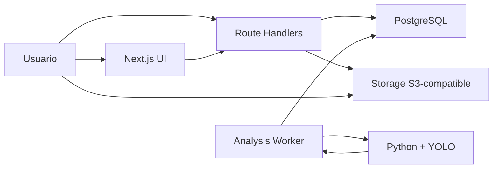

# Arquitectura del Sistema - DRIVXIS

Este documento explica como esta organizado el sistema, que partes lo componen y como se comunican.

## Tipo de arquitectura utilizada

DRIVXIS usa una arquitectura web cliente-servidor:

- El cliente/navegador consume una aplicacion web hecha con Next.js.
- El servidor Next.js renderiza paginas y expone endpoints HTTP mediante Route Handlers.
- La persistencia se maneja con PostgreSQL a traves de Prisma.

A nivel interno, se parece a un MVC simplificado:

- Vistas: paginas y componentes en `app/` y `components/`.
- Controladores: endpoints en `app/api/**/route.ts`.
- Modelo: Prisma en `prisma/schema.prisma` y acceso a datos desde `lib/prisma.ts`.

## Componentes principales

### Frontend

Ubicacion:

- `app/`
- `components/`

Responsabilidades:

- Landing page.
- Formularios de login/registro.
- Dashboard y paginas protegidas.
- Flujo de subida y registro de video desde el navegador.
- Visualizacion de metricas y estados.

### Backend/API

Ubicacion:

- `app/api/**/route.ts`

Responsabilidades:

- Autenticacion.
- Gestion de videos.
- Presign de carga a storage.
- Subida local cuando storage no esta configurado.
- Traduccion/cache si aplica.
- Reintentos de analisis.

### Base de datos

- PostgreSQL.
- Esquema principal: `prisma/schema.prisma`.
- Modelos principales: `User`, `Video`, `AnalysisJob`, `MetricSnapshot`, `TranslationCache`.

### Storage de videos

- Compatible con S3/R2/MinIO.
- Se usa para guardar archivos reales de video.
- La base de datos solo guarda metadata y `objectKey`.
- Si storage no esta configurado, se usa fallback local para desarrollo.

### Worker de analisis

Ubicacion probable:

- `scripts/analysis-worker.mjs`
- `analysis/`

Responsabilidades:

- Buscar jobs en cola.
- Ejecutar analisis de video.
- Actualizar progreso.
- Guardar resultados.

## Comunicacion entre partes

1. El navegador llama endpoints internos con `fetch('/api/...')`.
2. Los endpoints validan entrada con Zod.
3. Los endpoints usan Prisma para leer/escribir en PostgreSQL.
4. Para videos:
   - El navegador pide un presign a `/api/videos/presign`.
   - Si storage esta configurado, sube directo al bucket.
   - Si no, usa upload local.
   - Luego registra metadata con `POST /api/videos`.
   - El servidor crea un `AnalysisJob` en cola.
5. El worker procesa el job y guarda un `MetricSnapshot`.

## Diagrama Mermaid

## Archivos clave

### Sesion y proteccion

- `lib/session.ts`

Responsabilidades:

- Cookie `drivxis_session`.
- Firma HMAC.
- `requireUser()` para proteger rutas.

### Persistencia

- `lib/prisma.ts`
- `prisma/schema.prisma`

### Auth

- `app/api/auth/register/route.ts`
- `app/api/auth/login/route.ts`
- `app/api/auth/logout/route.ts`

### Videos

- `app/api/videos/presign/route.ts`
- `app/api/videos/route.ts`
- `app/api/videos/[id]/route.ts`
- `app/api/videos/[id]/stream/route.ts`
- `app/api/videos/[id]/analysis/retry/route.ts`

## Reglas para cambios de arquitectura

- No hacer refactors grandes sin plan previo.
- Para cambios grandes, primero pedir a Codex analisis sin modificar archivos.
- Si se cambia base de datos, revisar `docs/DATABASE.md`.
- Si se cambia API, revisar `docs/API.md`.
- Si se cambia worker, revisar `docs/ANALYSIS_PIPELINE.md`.
