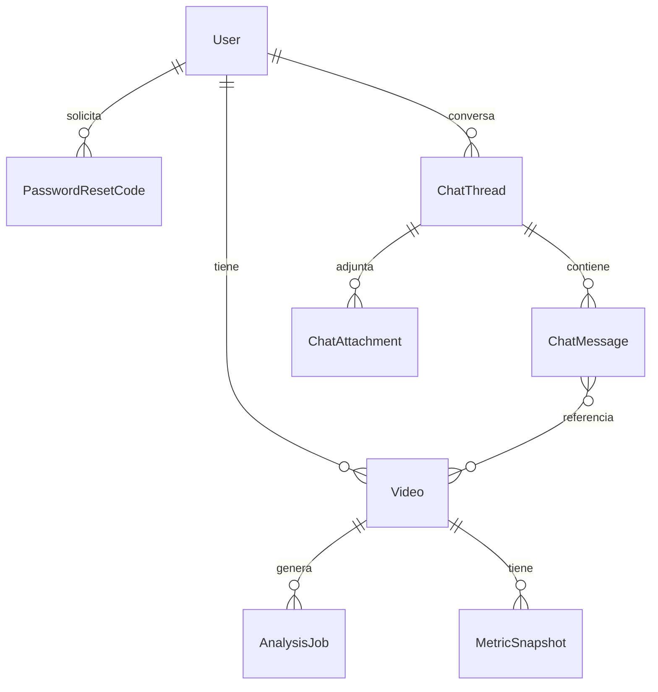

# Base de Datos - DRIVXIS

La base de datos esta pensada para soportar:

1. Usuarios y autenticacion.
2. Registro de videos con metadata y llave de storage.
3. Pipeline de analisis con jobs.
4. Resultados en snapshots de metricas.
5. Cache de traducciones.

La fuente principal del modelo vive en:

```txt
prisma/schema.prisma
```

## Modelos principales

### User

Guarda las cuentas del sistema.

Campos importantes:

- `id`
- `email`
- `name`
- `passwordHash`
- `role`
- `locale`
- `theme`
- `sessionVersion`
- `storageLimitBytes`
- `storageUsedBytes`
- `createdAt`
- `updatedAt`

Relacion:

- Un usuario puede tener muchos videos.
- Un usuario puede tener codigos temporales de recuperacion de contraseña.
- `storageLimitBytes` define la cuota maxima por usuario (1GB por defecto).
- `storageUsedBytes` mantiene el uso acumulado y se actualiza solo en backend/worker.

### PasswordResetCode

Guarda un hash del codigo de seis digitos, vencimiento, cantidad de intentos y momento de uso. Nunca persiste el codigo en texto plano y elimina su validez al cambiar la contraseña.

### Video

Representa un video registrado por un usuario.

Campos importantes:

- `ownerId`
- `objectKey`
- `originalFilename`
- `mimeType`
- `sizeBytes`
- `durationSeconds`
- `status`
- `metadata`
- `createdAt`
- `updatedAt`

Relaciones:

- Un video pertenece a un usuario.
- Un video puede tener muchos jobs de analisis.
- Un video puede tener muchos snapshots de metricas.

Estados esperados:

- `UPLOADED`
- `PENDING_ANALYSIS`
- `PROCESSING`
- `COMPLETED`
- `FAILED`

### AnalysisJob

Representa un trabajo o ejecucion de analisis para un video.

Campos importantes:

- `videoId`
- `status`
- `progress`
- `error`
- `startedAt`
- `endedAt`
- `createdAt`
- `updatedAt`

Estados esperados:

- `QUEUED`
- `RUNNING`
- `COMPLETED`
- `FAILED`

Justificacion:

- Permite reanalizar videos.
- Permite mostrar progreso.
- Permite guardar errores sin perder el video.

### MetricSnapshot

Guarda resultados generados por el analisis.

Campos importantes:

- `videoId`
- `jobId`
- `metrics`
- `createdAt`

Justificacion:

- `metrics` en JSON permite evolucionar metricas sin migrar columnas cada vez.
- Un video puede tener multiples snapshots.

### TranslationCache

Cache para traducciones.

Campos importantes:

- `locale`
- `sourceHash`
- `sourceText`
- `translatedText`
- `createdAt`
- `updatedAt`

## Relaciones Mermaid



### ChatThread, ChatMessage y ChatMessageVideo

`ChatThread` persiste título, modo y orden reciente por `lastMessageAt`. `ChatMessage` guarda rol, estado de streaming, comando y metadata de uso del modelo. `ChatMessageVideo` conserva las referencias explícitas `@video` sin copiar métricas al mensaje.

### ChatAttachment

Guarda únicamente metadata y `objectKey`; el documento vive en R2/S3. Se asocia al usuario, chat y, al enviarse, al mensaje. Su tamaño participa en `storageUsedBytes`.

### Fechas del partido

`Video.playedAt` y `Video.competition` son opcionales. El chatbot ordena por `playedAt` y usa `createdAt` como fallback para datos históricos existentes.

## Reglas importantes

- No guardar videos pesados en PostgreSQL.
- Guardar solo metadata, `objectKey`, estados y resultados.
- No permitir que el frontend edite cuotas (`storageLimitBytes` / `storageUsedBytes`).
- Ajustar `storageUsedBytes` en backend cuando:
  - se registra un video original,
  - el worker sube salidas procesadas,
  - se elimina un video y sus objetos remotos.
- Usar Prisma como fuente principal de estructura.
- No crear SQL manual salvo que sea necesario.
- Antes de cambiar modelos, analizar impacto en endpoints, UI y worker.

## Migraciones

Para aplicar cambios en local:

```bash
npm run prisma:migrate
```

Para generar cliente Prisma:

```bash
npm run prisma:generate
```

## Prompt recomendado para cambios de BD

```txt
Read first:
- AGENTS.md
- docs/CODEX.md
- docs/DATABASE.md

Do not modify files yet.
Analyze the safest Prisma change for:
[necesidad]

Return:
- model changes
- migration risks
- affected endpoints
- affected UI
- testing plan
```
